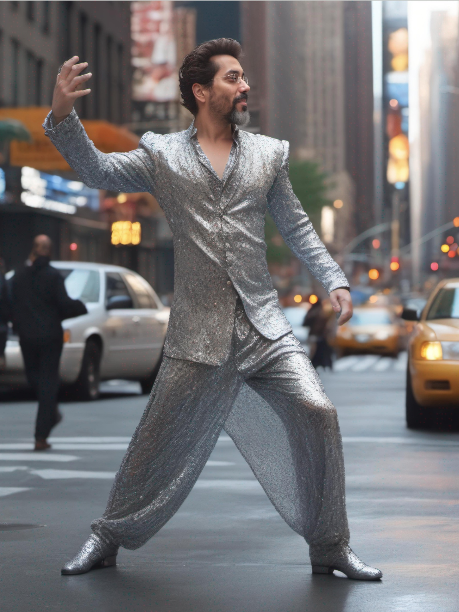
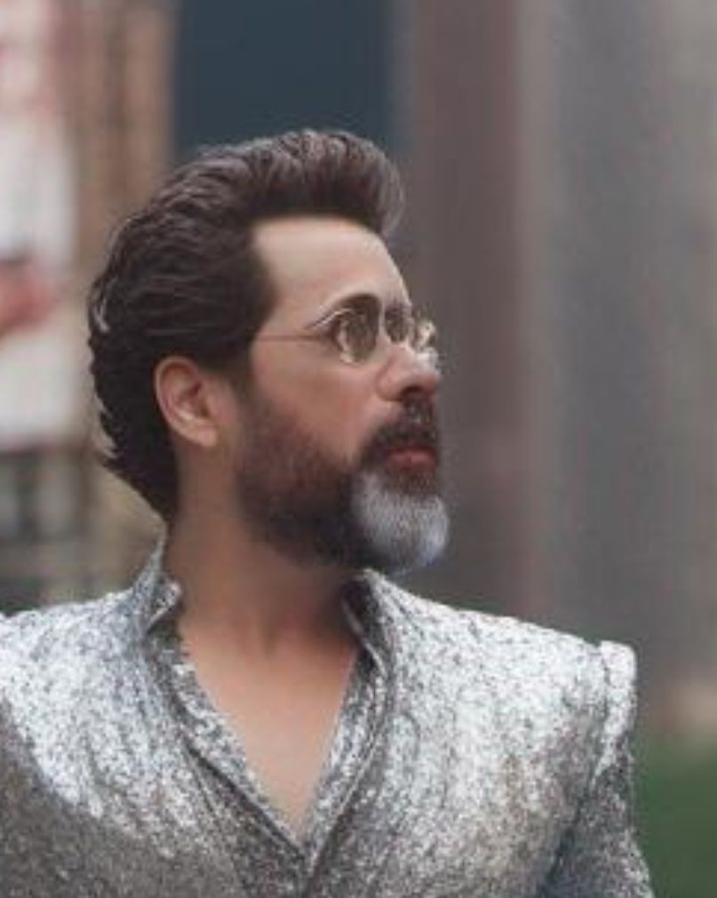

# Face inpainting

<figcaption>Entire picture</figcaption>

<figcaption>Before face-inpaint</figcaption>

<figcaption>After face-inpaint</figcaption>

Face-inpainting toggle under Advanced section will try to detect a human face in the picture, and then run a second inference on top of the detected face to improve facial features.
Note that face-inpainting requires super-resolution toggle to be turned on in order to get more pixels to work with.
