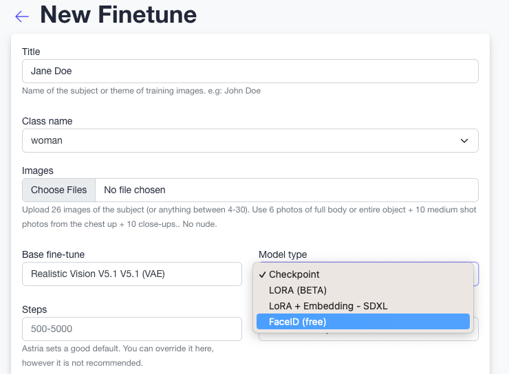

import Tabs from '@theme/Tabs';
import TabItem from '@theme/TabItem';


# FaceID
**BETA**

<div className="api-method">
<div>


<div style={{ display: "grid", 'grid-template-columns': '1fr 1fr', gap: '1.5rem' }}>
<div>
<figcaption>FaceID images</figcaption>


</div>

<div>
<figcaption>
<a href="https://www.astria.ai/gallery?text=faceid">Generations</a>
</figcaption>


</div>

</div>

See example prompts in the [gallery](https://www.astria.ai/gallery?text=faceid)

## Overview
FaceID is a model adapter allowing to generate image while preserving a person identity without fine-tuning. Input images can be as few as just one image.

## Usage
1. Generate a placeholder fine-tune dataset which will contain the person images. The fine-tune will not go through training and will be immediately ready.

2. Generate the image using the FaceID adapter using a syntax similar to LoRA - `<faceid:ID:1>` 

FaceID can work nicely together with [Face Swap](/docs/features/face-swap) to improve similarity.

</div>

<div>

#### POST /tunes/:id/prompts

<Tabs groupId="lang">
  <TabItem value="curl" label="cURL" default>

```bash showLineNumbers
# Note the hard-coded 690204 which is the tune_id of Realistic Vision v5.1 from the gallery
curl -X POST -H "Authorization: Bearer $API_KEY" https://api.astria.ai/tunes/690204/prompts \
          -F prompt[text]="<faceid:tune_id:strength> woman trekking in the alps" \
          -F prompt[negative_prompt]="" \
          -F prompt[super_resolution]=true \
          -F prompt[face_correct]=true \
          -F prompt[face_swap]=true \
          -F prompt[callback]="https://optional-callback-url.com/to-your-service-when-ready?prompt_id=1" 
```
  </TabItem>
  <TabItem value="javascript" label="Node.js">

```javascript
const fetch = require('node-fetch');
const FormData = require('form-data');

// Note the hard-coded 690204 which is the tune_id of Realistic Vision v5.1 from the gallery
const API_URL = 'https://api.astria.ai/tunes/690204/prompts';
const API_KEY = 'YOUR_API_KEY'; // Replace with your actual API key
const headers = { Authorization: `Bearer ${API_KEY}` }

const form = new FormData();
form.append('prompt[text]', '<faceid:tune_id:strength> woman trekking in the alps');
form.append('prompt[negative_prompt]', '');
form.append('prompt[super_resolution]', true);
form.append('prompt[face_correct]', true);
form.append('prompt[face_swap]', true);
form.append('prompt[callback]', 'https://optional-callback-url.com/to-your-service-when-ready?prompt_id=1');

fetch(API_URL, {
  method: 'POST',
  headers: headers,
  body: form
}).then(response => response.json())


```
  </TabItem>
  <TabItem value="python" label="Python">

```python
import requests

# Note the hard-coded 690204 which is the tune_id of Realistic Vision v5.1 from the gallery
API_URL = 'https://api.astria.ai/tunes/690204/prompts'
API_KEY = 'YOUR_API_KEY'  # Replace with your actual API key

headers = {
    'Authorization': f'Bearer {API_KEY}'
}

data = {
  'prompt[text]': '<faceid:tune_id:strength> woman trekking in the alps',
  'prompt[negative_prompt]': '',
  'prompt[super_resolution]': True,
  'prompt[face_correct]': True,
  'prompt[face_swap]': True,
  'prompt[callback]': 'https://optional-callback-url.com/to-your-service-when-ready?prompt_id=1'
}
files = []
files.append((f"tune[prompts_attributes][{i}][input_image]", load_image(prompt['input_image'])))

response = requests.post(API_URL, headers=headers, data=data)
```
  </TabItem>
</Tabs>

</div>
</div>
