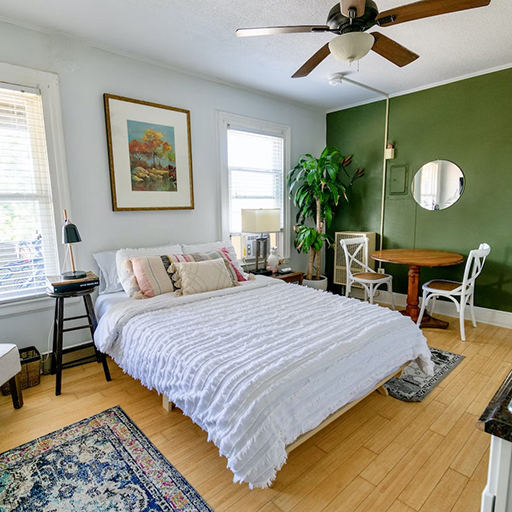
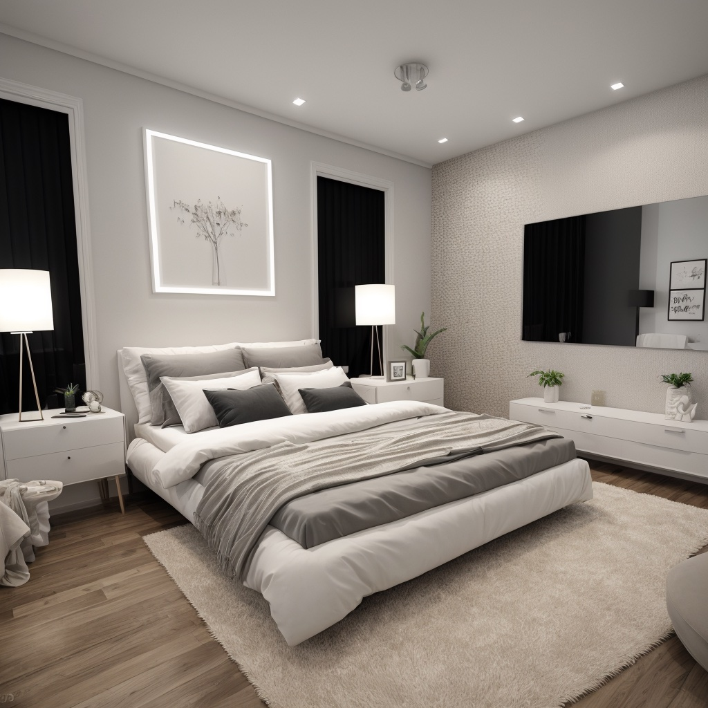
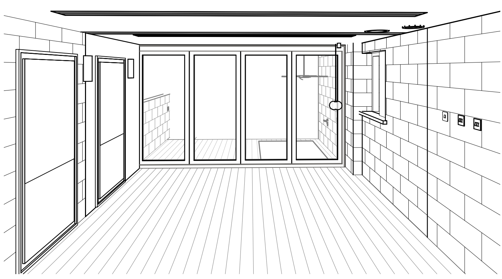
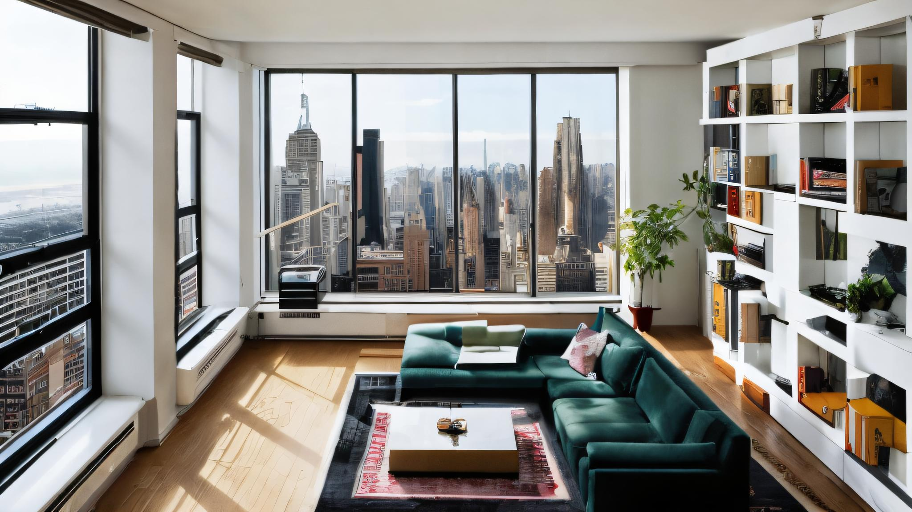

# AI Interior Design
**Backend V1**

<div style={{ display: "grid", 'grid-template-columns': '1fr 1fr', gap: '1.5rem' }}>
<div>
<figcaption>Original room</figcaption>


</div>

<div>
<figcaption>Generated using mlsd</figcaption>


</div>

<div>
<figcaption>Generated room using segroom + mlsd</figcaption>


</div>

<div>
<figcaption>Generated room with window masking</figcaption>


</div>

<div>
<figcaption>Original sketch</figcaption>


</div>

<div>
<figcaption>Generated room with window masking</figcaption>


</div>

</div>


See example prompts in the [photobooth](https://www.astria.ai/photobooth?controlnet=mlsd) page or in the [gallery](https://www.astria.ai/gallery?controlnet=mlsd).

## Overview

AI Interrior design is the term for the process of generating images of a room with different furniture, wall colors, and decorations all while keeping the original room layout. This can be useful for interior designers, real estate agents, or when planning a renovation.

## How to use

In order to preserve the room layout use either controlnet `mlsd` or `segroom`. Input images can be sketches, 3d models, or photos of the room. Depending on the input, you might need to adjust the strength and combination of controlnets as well as the prompts.

Controlnet `segroom` is a specific controlnet that was trained to preserve the meaning of the room layout, such as walls and windows.

Controlnet `mlsd` is a more general model, used with a pre-processor that produces straight lines and is suitable for architecture.

`mlsd` is support for both SDXL and SD1.5 models while `segroom` is only available for SD1.5 models.

You may use the [multi-controlnet](/docs/features/multi-controlnet) option to combine both controlnets like `--controlnets mlsd segroom --controlnet_weights 1 0.5`.

Additionally you may decide to automatically mask out windows and doors by using the `--mask_prompt windows door --mask_invert` prompt. See more information on [prompt masking syntax](/docs/features/prompt-masking).

### Example prompt

````text
Clean scandinavian design living room, natural light, architecture magazine cover  <lora:epi_noiseoffset2:0.5><lora:FilmVelvia2:0.5><lora:add_detail:0.5><lora:epiCRealismHelper:0.2> --mask_prompt windows door --mask_invert --controlnets mlsd segroom --controlnet_weights 0.5 1
num_images=1
negative_prompt=painted, sketch, deformed, easynegative
seed=
steps=30
cfg_scale=
controlnet=lineart
input_image_url=https://sdbooth2-production.s3.amazonaws.com/du6cwkp9nojx3ze66vv5nqi39jxo
mask_image_url=
denoising_strength=1
controlnet_conditioning_scale=
controlnet_txt2img=false
super_resolution=true
inpaint_faces=false
face_correct=false
film_grain=false
face_swap=false
hires_fix=true
backend_version=1
ar=1:1
scheduler=dpm++sde_karras
color_grading=
use_lpw=true
w=
h=
````
